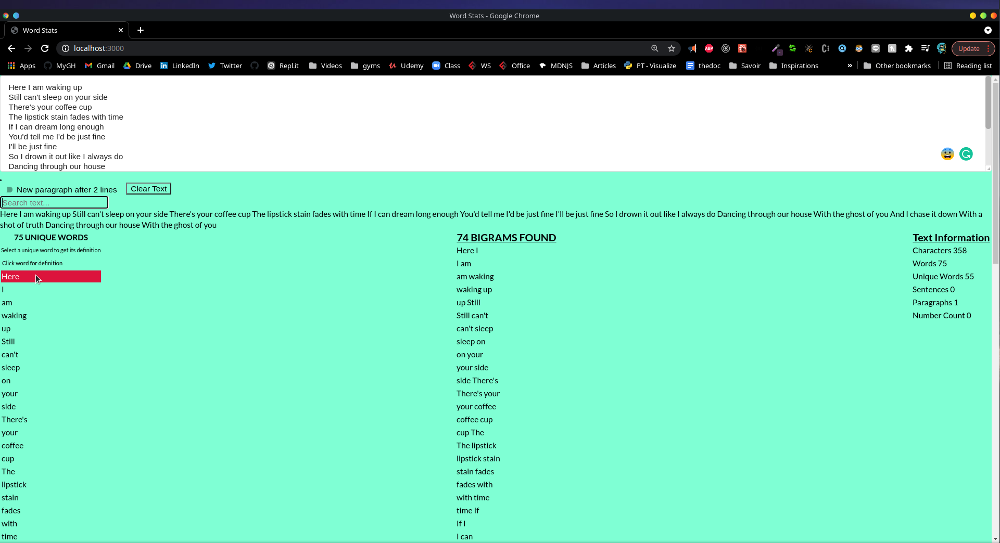
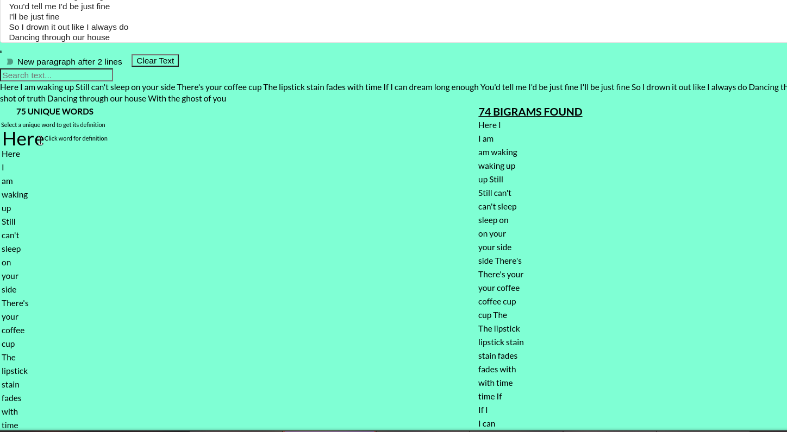
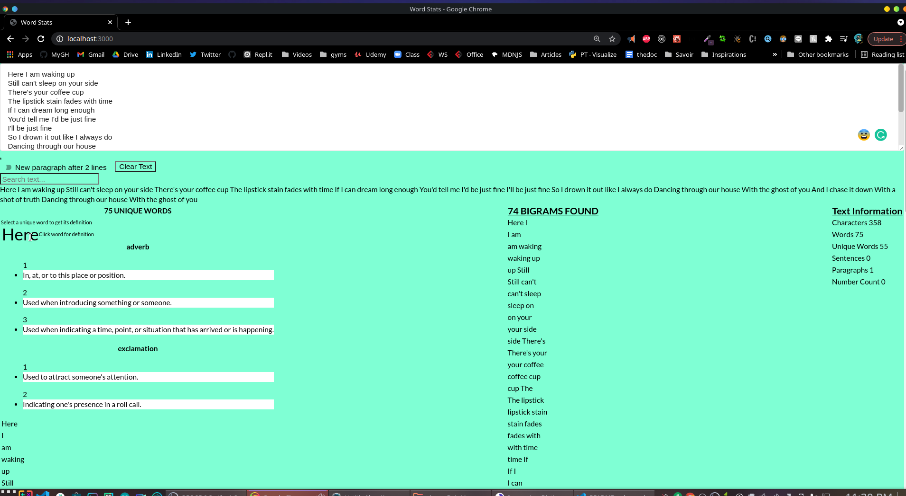

# wordcountchallenge

1. Clone the repository and cd into it

```bash
git clone https://github.com/Anclaudys/wordcountchallenge.git && cd wordcountchallenge
```

2. Install the dependencies

```bash
npm install
```

3. Start the server and on the browser, navigate to http://localhost:3000/

```bash
npm start
```

**How to highlight text**


**How to get the definition of a unique word**

1. Select one of the unique words.
   
2. Click on one of the unique words.
   
3. Once that unique word is enlarged, click on it again, to see the definition
   
